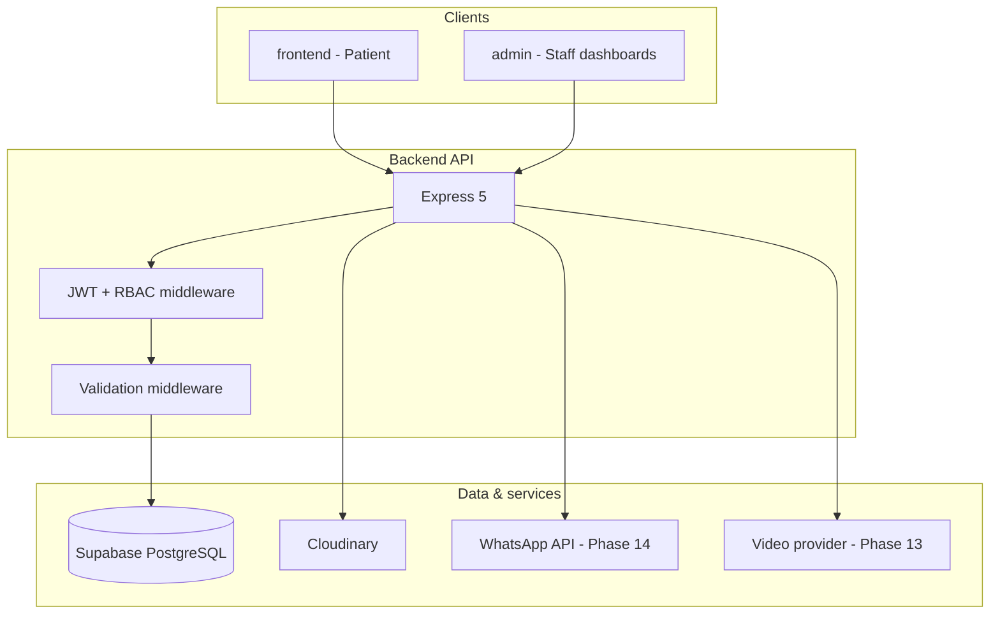
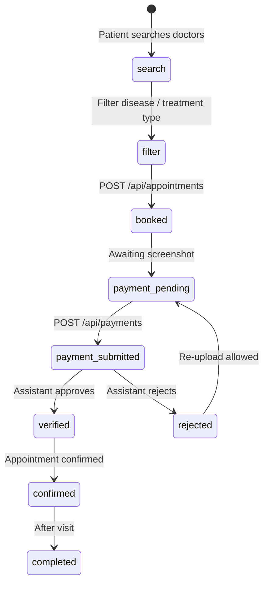

# Doctor Hub — Architecture

## 1. System overview

Three-tier web application:

## 2. User roles (RBAC)

| Role | Key permissions |
|------|-----------------|
| **patient** | Register (public), book appointments, upload payment proof & medical reports, view own history, message doctor |
| **doctor** | Manage clinics/schedules, appointments, append-only history & prescriptions, message patients |
| **assistant** | Verify payments, manage bookings for assigned clinic/doctor |
| **admin** | Manage doctors and users |
| **super_admin** | Full system control (users, roles, clinics, assistants) |

JWT payload includes `userId` and `role`. Middleware: `authenticate` → `authorizeRoles(...)`.

## 3. Database (9 tables — Phase 1)

| Table | Purpose |
|-------|---------|
| `users` | Auth credentials, role, profile basics |
| `patients` | Patient profile extension (`user_id`) |
| `doctors` | Doctor profile, diseases, treatment types |
| `assistants` | Assistant profile, clinic/doctor link |
| `clinics` | Clinic locations and metadata |
| `appointments` | Booking + workflow status |
| `payments` | Screenshot proof, verification state |
| `medical_history` | Immutable append-only records |
| `prescriptions` | Immutable prescriptions |

### Medical data rules (enforced in API + DB)

- No `DELETE` on `medical_history` or `prescriptions`.
- Doctors: `INSERT` only on history/prescriptions (no update/delete of existing rows).
- Patients cannot delete prescriptions created by doctors.

## 4. Appointment workflow (6 steps)

| Status | Meaning |
|--------|---------|
| `payment_pending` | Slot reserved, no proof yet |
| `payment_submitted` | Screenshot uploaded |
| `verified` | Assistant approved payment |
| `confirmed` | Patient can attend |
| `rejected` | Payment rejected |
| `completed` | Visit done |
| `cancelled` | Optional — only if product rules allow |

## 5. API layout (target)

Documented minimum routes plus supporting routes so no feature is incomplete. Full list: `docs/API_ROUTES.md`.

Legacy CareLink routes under `/api/user`, `/api/doctor`, `/api/admin` remain until refactored in Phases 2–5.

## 6. Security

| Requirement | Implementation |
|-------------|----------------|
| JWT authentication | `Authorization: Bearer <token>` |
| Encrypted passwords | bcrypt (salt rounds 10) |
| Validation middleware | express-validator / Zod (Phase 2) |
| Secure APIs | HTTPS in production, CORS allowlist, helmet, rate limits — see `docs/SECURITY.md` |
| Protected medical records | Role + ownership checks on `/api/history` and related |

## 7. What we are not building in the app

- **Analytics dashboards** for marks — replaced by a **written project report** at the end.
- Stripe checkout (replaced by manual payment verification per documentation).

## 8. Future enhancements (code phases 12–15)

1. AI disease prediction  
2. Video consultation  
3. WhatsApp notifications  
4. E-prescription PDF generation  

## 9. Reuse from CareLink

| Reused (logic / structure) | Replaced for Doctor Hub |
|----------------------------|-------------------------|
| Express bootstrap, Supabase client, Cloudinary, multer | Unified `users` + RBAC |
| Slot booking algorithm | Payment + assistant workflow |
| 3-app monorepo layout | 9-table schema, new routes |
| React contexts, axios patterns | Branding, pages, Stripe removal |

## 10. Phase map

See `docs/PHASES.md`.
